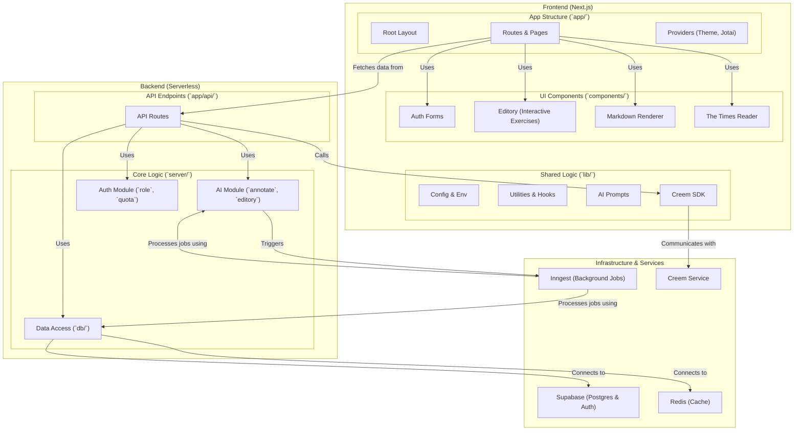

## Leximory

### Introduction

> *Leximory* is a language learning platform designed to enhance foreign language proficiency, vocabulary in particular, by means of **intensive input**. 

Leximory integrates features like:

- One-click **foreign publication importing**,
- **Annotated novels and news** updated every day,
- AI-driven targeted **annotations with etymologies**, 
- **Combination of listening** with reading, 
- **Easy reviewing** of saved words,
- Saving through our **iOS Shortcuts Integration**,
- Sharing study resources in the **Library Market**,
- Talking to your library, i.e. **agentic workflows**.

There is also a feature built for exam setters: `Fix. Your. Paper.`.

The platform is built with Next.js, Supabase, Upstash, and Inngest. AI providers are Google and ElevenLabs.

### Project Structure

### Environment Variables

Please refer to [`env.ts`](./lib/env.ts).
