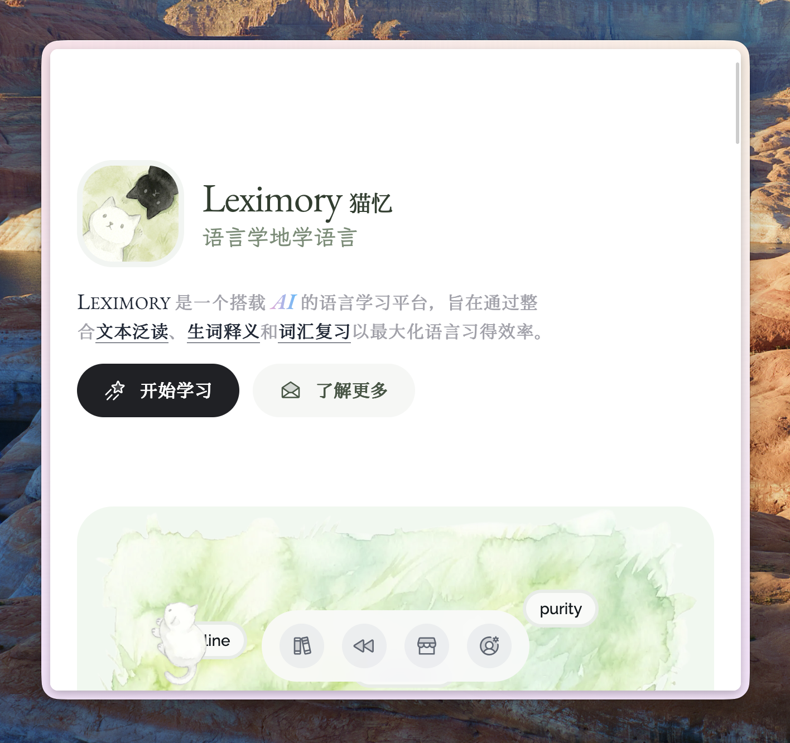
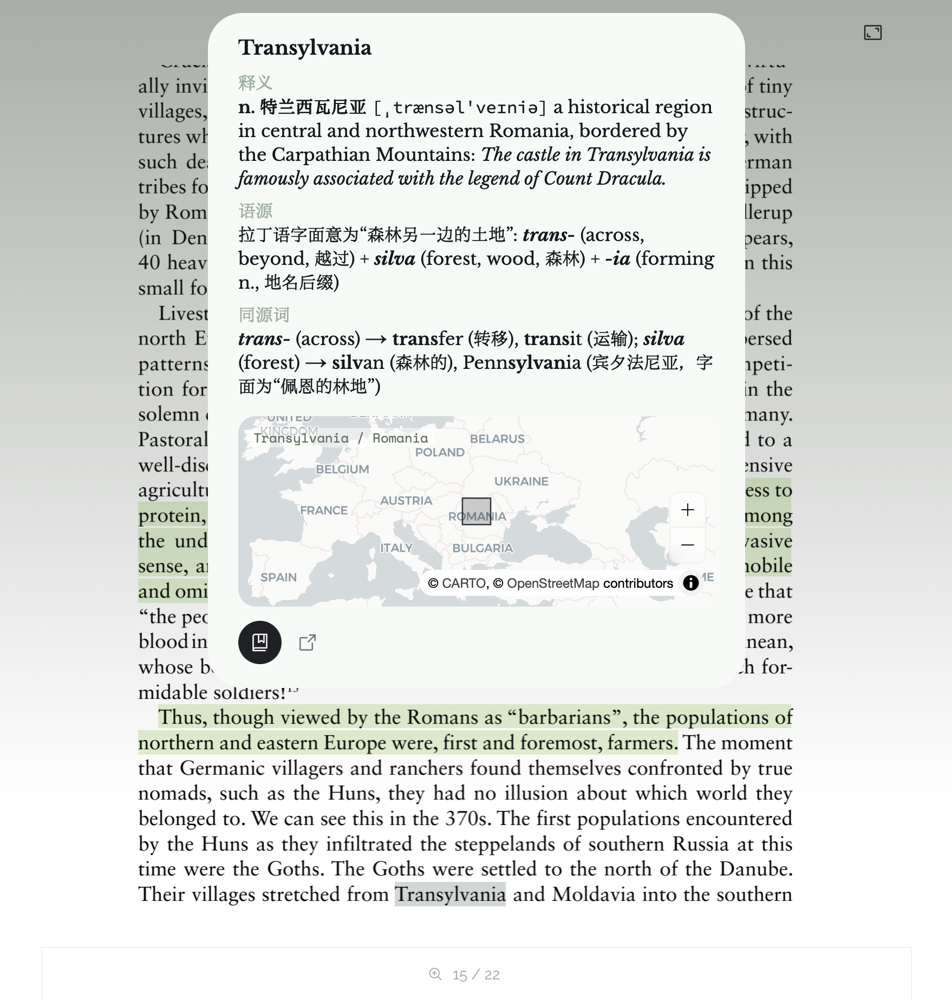
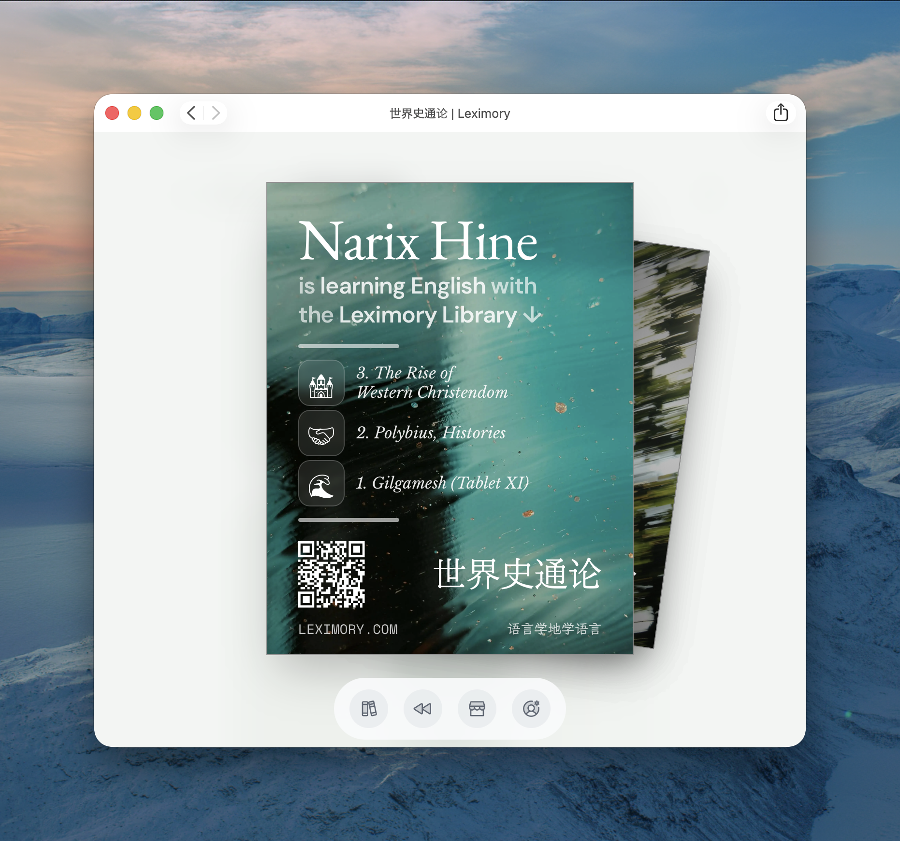

# Leximory





Leximory is a language-learning app built around extensive input. Point it at an ebook, article, or newspaper and it imports the text, annotates the words you don't know, and saves them for later review.

This repo is the pnpm + Turborepo monorepo behind it. Two smaller apps sit alongside Leximory and reuse the same packages:

| Workspace | What it is |
| --- | --- |
| [`apps/leximory`](./apps/leximory) | The main app. |
| [`apps/quiz`](./apps/quiz) | 猫谜 — drills built from curated practice papers. |
| [`apps/pouncepen`](./apps/pouncepen) | A paper editor for exam setters ("Fix. Your. Paper."). |

Shared contracts, services, and UI live in `packages/` so the apps stay consistent.

## Stack

- **Framework:** Next.js 16 (App Router), React 19
- **Data:** Supabase (Postgres + Auth)
- **Cache and jobs:** Upstash Redis, Inngest, QStash
- **AI and audio:** AI Gateway (Google Vertex), ElevenLabs
- **UI:** Tailwind v4, HeroUI
- **Billing:** Creem

## Architecture

- `apps/leximory/app/` — routes, layouts, and route handlers.
- `apps/leximory/components/` — reusable UI.
- `apps/leximory/service/` — Server Actions.
- `apps/leximory/server/` — server-only auth, database, AI, geo, and Inngest code.
- `apps/leximory/lib/` — app-local helpers. `@/*` resolves from `apps/leximory`.

Shared code lives in workspace packages. Import through a package's `exports` map, never its private `src/` files:

- `@repo/schema` — Zod contracts.
- `@repo/env` — validated configuration and shared constants.
- `@repo/supabase` — typed database and auth clients.
- `@repo/service` — reusable server-domain services.
- `@repo/ui` — reusable UI.
- `@repo/kv`, `@repo/languages`, `@repo/scrape`, `@repo/user`, `@repo/utils` — cross-app concerns.

## Getting started

Prerequisites: [pnpm](https://pnpm.io/installation).

```bash
pnpm install
```

Config lives in `apps/leximory/.env`, validated against [`packages/env/src/index.ts`](./packages/env/src/index.ts).

### Database

Create a Supabase project and run the schema SQL in [`apps/leximory/README.md`](./apps/leximory/README.md#4-set-up-supabase).

### Develop

Run all the apps and packages in the monorepo:

```bash
pnpm dev
```
