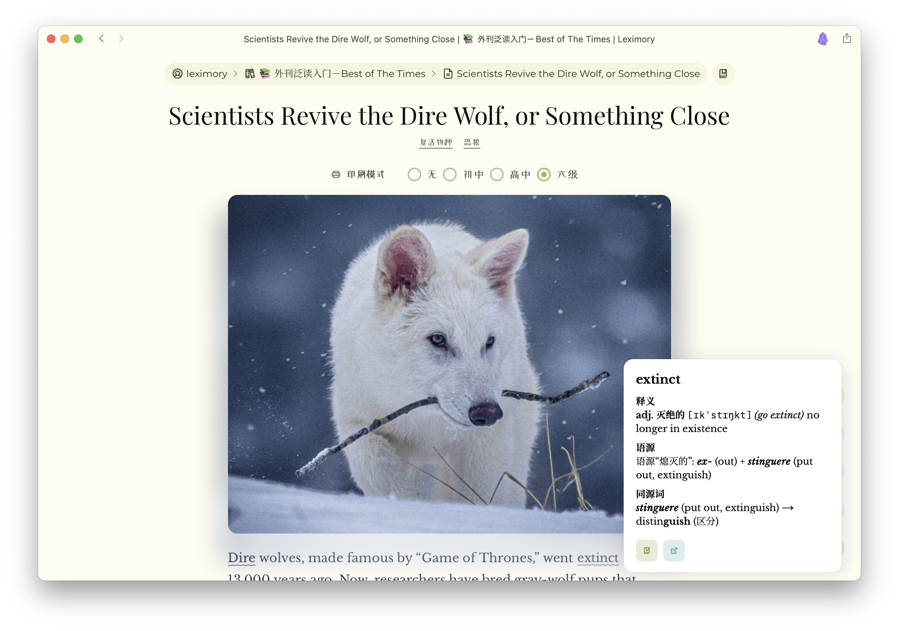

## Leximory



### Introduction

> *Leximory* is a language learning platform designed to enhance foreign language proficiency, vocabulary in particular, by means of **intensive input**. 

Leximory integrates features like:

- One-click **foreign publication importing**,
- **Annotated novels and news** updated every day (currently paused),
- AI-driven targeted **annotations with etymologies**, 
- **Combination of listening** with reading, 
- **Easy reviewing** of saved words,
- Saving through our **iOS Shortcuts Integration**,
- Sharing study resources in the **Library Market**,
- Talking to your library, i.e. **agentic workflows**.

There is also a feature built for exam setters: `Fix. Your. Paper.`.

The platform is built with Next.js, Supabase, Upstash, and Inngest. AI providers are Google Vertex and ElevenLabs.

### Project Structure


### Deploy Your Own

To deploy your own instance of Leximory, follow these steps:

#### 1. Prerequisites

Ensure you have [pnpm](https://pnpm.io/installation) installed.

#### 2. Clone the Repository

```bash
git clone https://github.com/narixhine/leximory.git
cd leximory
```

#### 3. Install Dependencies

Install the project dependencies using `pnpm`:

```bash
pnpm install
```

#### 4. Set Up Supabase

1.  Create a new project on [Supabase](https://supabase.com/).
2.  Navigate to the **SQL Editor** in your Supabase project dashboard.
3.  Copy the script below and paste it into the SQL Editor.
4.  Click **Run** to execute the script and create the necessary database tables.

```sql
CREATE TABLE "users" (
    "id" uuid PRIMARY KEY DEFAULT gen_random_uuid(),
    "updated_at" timestamp with time zone,
    "creem_id" text,
    "plan" text DEFAULT 'beginner'::text NOT NULL,
    "lexicoin" integer DEFAULT 20 NOT NULL,
    "last_daily_claim" timestamp with time zone,
    "accent" text DEFAULT 'BrE'::text NOT NULL,
    "token" text,
    "archived_libs" text[]
);

CREATE TABLE "libraries" (
    "id" text PRIMARY KEY NOT NULL,
    "updated_at" timestamp with time zone,
    "name" text NOT NULL,
    "lang" text NOT NULL,
    "owner" uuid NOT NULL,
    "access" smallint DEFAULT 0 NOT NULL,
    "shadow" boolean DEFAULT false NOT NULL,
    "starred_by" uuid[],
    "org" text,
    "price" integer DEFAULT 0 NOT NULL,
    "prompt" text,
    CONSTRAINT "libraries_owner_fkey" FOREIGN KEY ("owner") REFERENCES "users" ("id") ON DELETE CASCADE
);

CREATE TABLE "lexicon" (
    "id" uuid PRIMARY KEY DEFAULT gen_random_uuid(),
    "updated_at" timestamp with time zone,
    "word" text NOT NULL,
    "lib" text,
    "created_at" timestamp with time zone,
    CONSTRAINT "lexicon_lib_fkey" FOREIGN KEY ("lib") REFERENCES "libraries" ("id") ON DELETE CASCADE
);

CREATE TABLE "texts" (
    "id" text PRIMARY KEY NOT NULL,
    "updated_at" timestamp with time zone,
    "title" text NOT NULL,
    "content" text,
    "lib" text,
    "has_ebook" boolean DEFAULT false NOT NULL,
    "topics" text[],
    "no" integer,
    "created_at" timestamp with time zone,
    CONSTRAINT "texts_lib_fkey" FOREIGN KEY ("lib") REFERENCES "libraries" ("id") ON DELETE CASCADE
);

CREATE TABLE "subs" (
    "id" uuid PRIMARY KEY DEFAULT gen_random_uuid(),
    "updated_at" timestamp with time zone,
    "uid" uuid,
    "subscription" jsonb,
    "hour" smallint,
    "created_at" timestamp with time zone,
    CONSTRAINT "subs_uid_fkey" FOREIGN KEY ("uid") REFERENCES "users" ("id") ON DELETE CASCADE
);

CREATE TABLE "times" (
    "id" serial PRIMARY KEY,
    "date" date NOT NULL,
    "created_at" timestamp with time zone NOT NULL,
    "news" text NOT NULL,
    "novel" text NOT NULL,
    "quiz" jsonb,
    "cover" text NOT NULL,
    "audio" text,
    "is_sequel" boolean DEFAULT false NOT NULL,
    "raw_news" text
);

-- Enable Row Level Security
ALTER TABLE public.users ENABLE ROW LEVEL SECURITY;
ALTER TABLE public.libraries ENABLE ROW LEVEL SECURITY;
ALTER TABLE public.lexicon ENABLE ROW LEVEL SECURITY;
ALTER TABLE public.texts ENABLE ROW LEVEL SECURITY;
ALTER TABLE public.subs ENABLE ROW LEVEL SECURITY;
ALTER TABLE public.times ENABLE ROW LEVEL SECURITY;
```

#### 5. Set Up Environment Variables

Create a `.env.local` file in the root of the project by copying the example file:

```bash
cp .env.example .env.local
```

You will need to populate this file with credentials from the following services:

*   **Supabase**:
    *   `SUPABASE_URL`
    *   `SUPABASE_SERVICE_ROLE_KEY`
    *   `NEXT_PUBLIC_SUPABASE_URL`
    *   `NEXT_PUBLIC_SUPABASE_ANON_KEY`
*   **Upstash**:
    *   `UPSTASH_REDIS_REST_URL`
    *   `UPSTASH_REDIS_REST_TOKEN`
*   **Google Cloud (Vertex AI)**:
    *   `GOOGLE_VERTEX_CLIENT_EMAIL`
    *   `GOOGLE_VERTEX_PRIVATE_KEY`
    *   `GOOGLE_VERTEX_PROJECT`
    *   `GOOGLE_VERTEX_LOCATION`
*   **ElevenLabs**:
    *   `ELEVENLABS_API_KEY`
*   **Cloudflare R2**:
    *   `R2_ACCOUNT_ID`
    *   `R2_ACCESS_KEY_ID`
    *   `R2_SECRET_ACCESS_KEY`
    *   `R2_BUCKET_NAME`
    *   `R2_PUBLIC_URL`
*   **Creem**:
    *   `CREEM_API_KEY`
    *   `CREEM_WEBHOOK_SECRET`
*   **Web Push Notifications**:
    *   `VAPID_PRIVATE_KEY`
    *   `NEXT_PUBLIC_VAPID_PUBLIC_KEY`
*   **General**:
    *   `NEXT_PUBLIC_URL`: The public URL of your deployment.

While we incorporate Cloudflare R2 and Creem as necessary components of the Leximory infrastructure, you can modify or replace them when developing locally. (R2 is a storage solution *at scale*, and Creem is for subscription processing, neither of which is required for local development.)

#### 6. Run the Development Server

To start the development server, which also runs the Inngest development server concurrently:

```bash
pnpm dev
```

Open [http://localhost:3000](http://localhost:3000) in your browser to see the result.
